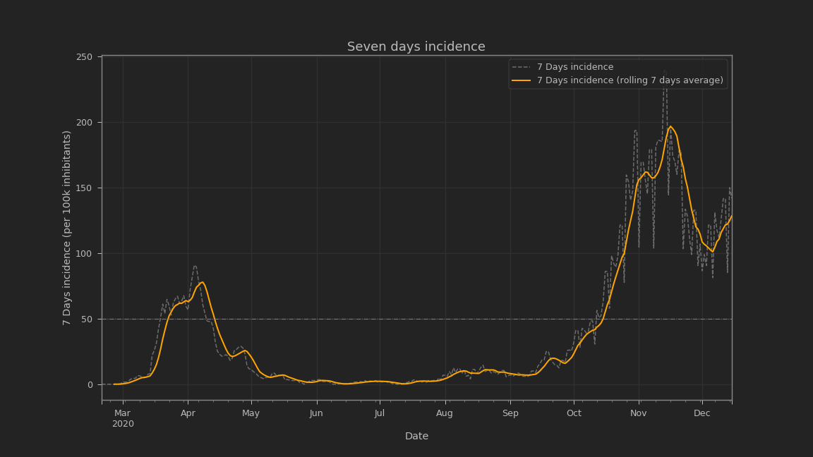
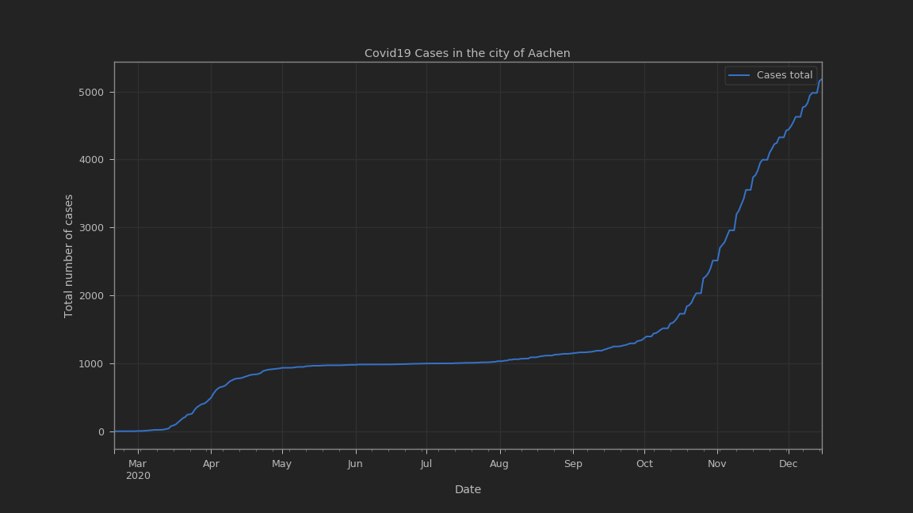
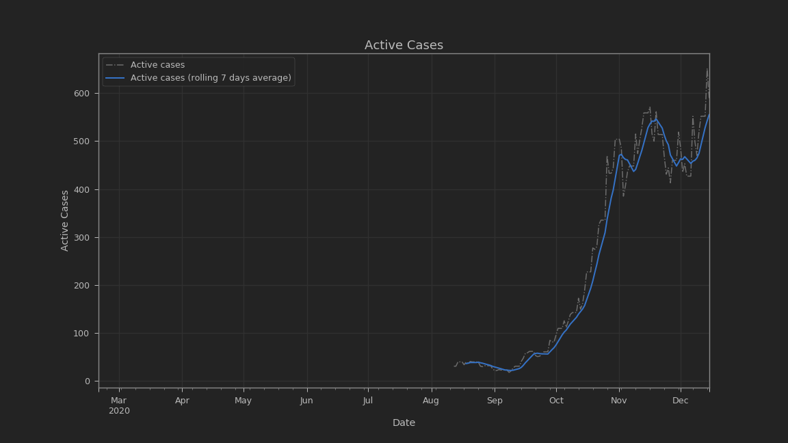
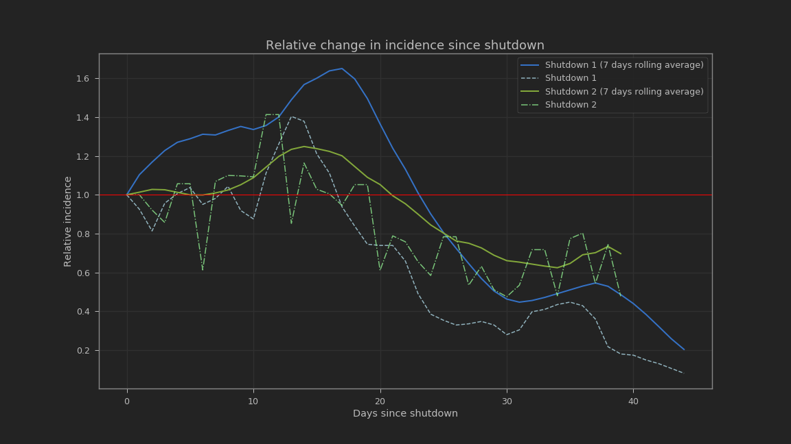

# COVID19 Data and Web-Scraper for Aachen (City & Region)
This small repository contains the official data as published by the authorities of the city and region of Aachen, Germany. They are continuesly scraped from the official [website of the City of Aachen](https://www.aachen.de/DE/stadt_buerger/notfall_informationen/corona/aktuelles/index.html). Furthermore the repository contains a small set of python scripts, bash scripts and python notebooks, which are used for scraping the desired data from the web and evaluating them.

**Disclaimer**

**Please note, that we do not take any responsibility for the correctness of the provided datasets. If you want to assure its correctness, please compare these datasets with the official data published by the authorities and the [Robert-Koch-Institute](https://www.rki.de/DE/Content/InfAZ/N/Neuartiges_Coronavirus/Daten/Fallzahlen_Kum_Tab.html).**

## Data Formating
The data is provided in various file formats. These are:
- SQLite
- CSV
- JSON

## Evaluating the data
You can find some pre-written jupyter notebooks for the evaluation of the provided data in the ```scripts``` directory. Although you the ```.csv``` and ```.json``` files should be up to date, you might want to alter the data within the sqlite database yourself. In this case you can use the ```export_data.py``` script to export the data from the sqlite database.


### Examples of evaluations






## Contribution
If you have anything to contribute (e.g. bug-reports etc.) to this little project, please feel free to open an issue or start a pull request.

## Licenses
### Database & other data formats
All data contained in the ```data``` directory is licensed under the Open Database License. Please see the [LICENSE.md](data/LICENSE.md) file for further information.

### Web-Scraper & Notebooks
All source code provided in this project is licensed under the MIT license. Please see the [LICENSE.md](scripts/LICENSE.md) file for further information.
